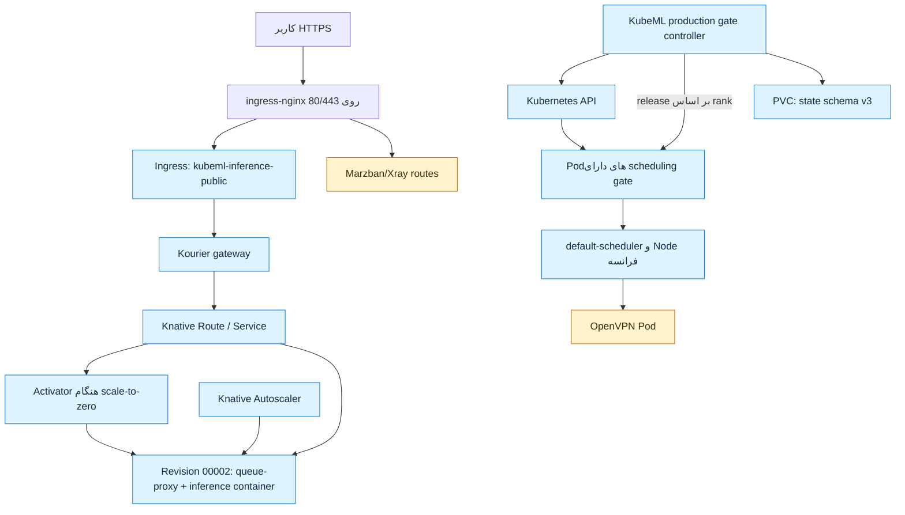

# دسترسی SSH، مشاهده با K9s و دیاگرام فرانسه

تاریخ snapshot: ۲۰۲۶-۰۸-۰۸

## ورود از لپ‌تاپ ویندوزی فعلی

Alias و کلید SSH از قبل روی همین لپ‌تاپ تنظیم شده‌اند. در PowerShell یا Windows
Terminal اجرا کنید:

```powershell
ssh fr-k8s
```

این Alias با کاربر `root` به `167.104.216.211:22` وصل می‌شود، کلید
`~/.ssh/parapolu_k8s` را استفاده می‌کند و از آلمان با Alias `de-parapolu` به‌عنوان
Jump Host عبور می‌کند. معادل بدون Alias مقصد فرانسه:

```powershell
ssh -J de-parapolu -i "$HOME/.ssh/parapolu_k8s" root@167.104.216.211
```

برای عیب‌یابی اتصال بدون ورود تعاملی:

```powershell
ssh -vvv fr-k8s
```

## بازکردن K9s

پس از ورود به فرانسه، حالت امن فقط‌خواندنی را باز کنید:

```bash
k9s --readonly -A
```

برای کار مدیریتی آگاهانه:

```bash
k9s -A
```

کلیدها و فرمان‌های پرکاربرد داخل K9s:

| ورودی | کاربرد |
|---|---|
| `?` | نمایش راهنمای کلیدهای صفحهٔ فعلی |
| `:ns` | فهرست Namespaceها |
| `:pods` | همهٔ Podها |
| `:deploy` | Deploymentها |
| `:svc` | Serviceها |
| `:pulses` | نمای کلی منابع و سلامت |
| `:xray deploy ai-scheduler` | درخت ارتباط Deploymentهای Namespace زمان‌بند |
| `:xray deploy kubeml-inference` | درخت Deploymentهای Namespace inference |
| `:xray svc kubeml-inference` | درخت Serviceهای Namespace inference |
| `d` | Describe منبع انتخاب‌شده |
| `l` | Log منبع انتخاب‌شده |
| `v` | YAML منبع انتخاب‌شده |
| `Esc` | بازگشت |
| `:q` | خروج |

در syntax دستور XRay، آرگومان بعد از نوع منبع **Namespace** است، نه نام یک
Deployment. XRay یک درخت تعاملی داخل ترمینال می‌دهد؛ فایل PNG/SVG صادر نمی‌کند.

## بررسی سریع بدون K9s

```bash
kubectl get nodes -o wide
kubectl get pods -A
kubectl -n ai-scheduler get deploy,pods,pvc
kubectl -n kubeml-inference get ksvc,route,revision,pods
kubectl -n parapolu get pods
kubectl -n vpn get pods
```

## Snapshot زندهٔ معماری



نکتهٔ معماری: ingress-nginx تنها listener میزبان روی پورت‌های 80/443 است. Kourier
از نوع ClusterIP نگه داشته شده تا با مسیرهای VPN برخورد نکند. ترافیک Knative در
حالت صفر replica ابتدا از Activator می‌گذرد و بعد از scale-up می‌تواند مستقیم به
Revision برسد.

## وضعیت منابع در این snapshot

- Node: `yta25989632`، Ready، K3s `v1.36.2+k3s1`
- Scheduler: `kubeml-scheduler-ml-ai-scheduler`، `1/1` Ready
- Knative Service: `kubeml-inference`، Ready
- Latest Ready Revision: `kubeml-inference-00002`، در حالت idle با `0/0` replica
- VPN: Podهای Marzban France و OpenVPN هر دو Running
- Headlamp: فقط ClusterIP است و از اینترنت expose نشده است

این دیاگرام snapshot عملیاتی است، نه نمودار نتایج مقاله. نمودارهای JCT، ECDF و
IQR تنها بعد از اجرای معتبر Plan ۷۰تایی توسط Analyzer تولید می‌شوند.

